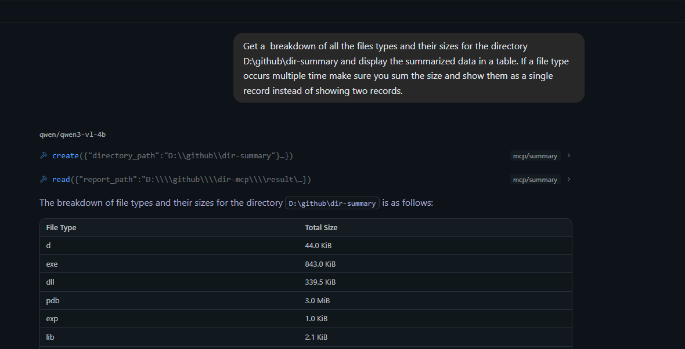

# dir-mcp

This is an MC sever written in python using FastMCP. It uses a rust binary to perform the file operations.

Binary can be downloaded using [link](https://github.com/JustAnotherSoloDev/dir-summary/releases) when the mcp server receives any command it calls the rust binary to do the processing quickly and returns the result to the LLM.

## How to run.

1. setup a new environment (Optional)
   
   ``` 
    python -m venv .venv
    .venv\Scripts\activate.bat 
    ```
2. Install dependencies
   
   ```
   pip install requirements.txt
   ```
3. run server
pyth
    ```
    python main.py
    ```

## How to connect to lm studio.

Edit mcp json and add local MCP server url
```
{
  "mcpServers": {
    "summary": {
      "url": "http://127.0.0.1:8000/mcp "
    }
  }
}
```

This will add the summary plugin in the integrations and you will have the tools available in yur llm.

## Prompts 
Calculate size of a directory
```
calculate size of D:\Python\dir-summary and show me the details of the files and folders in the directory.

```

```
get the largest file in D:\Python\dir-summary.

```
```
Get a  breakdown of all the files types and their sizes for the directory D:\github\dir-summary and display the summarized data in a table. If a file type occurs multiple time make sure you sum the size and show them as a single record instead of showing two records.
```





